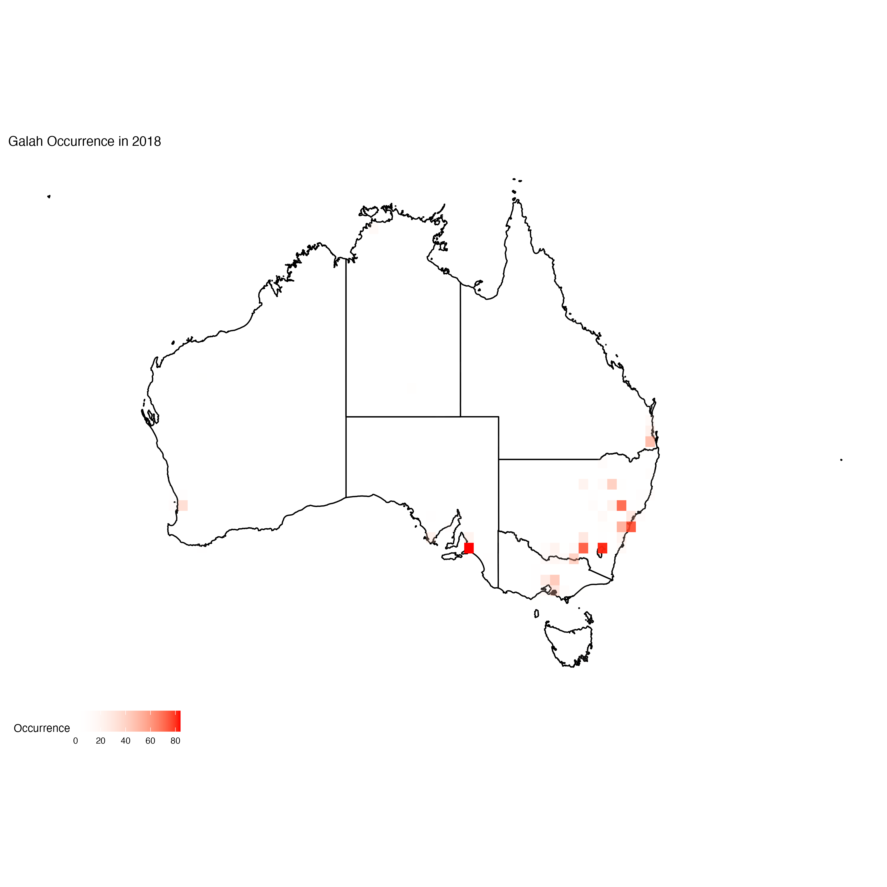

# sdm-ecocommons
Species Distribution Models using the new EcoCommons platform to determe data inputs from FishID-analysed data

## Sampling bias
Map illustrating sampling bias of galahs during 2018. Occurrence data obtained from ALA with a 'HUMAN_OBSERVATION' filter. 

